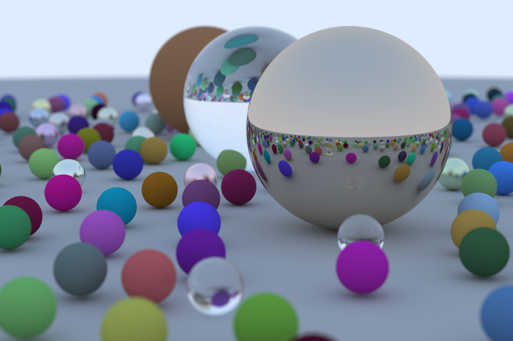

This repo. is implementation of [Ray Tracing in One Weekend](https://raytracing.github.io/books/RayTracingInOneWeekend.html) in Nim.

I appreciate the awesome authors for making this material open to the public.

# Note
This program runs in parallel, but BVH or other data structures are not implemented. So it should be slow.
The image size and sampling number are set a relatively small number.
If you want to change it, edit the values in the `src/scene.nim`

# Compile
```Bash
cd src
make
```

# Run
```Bash
make run
```

Rendered image will be saved in `src/outputs/rendered_img.ppm`

